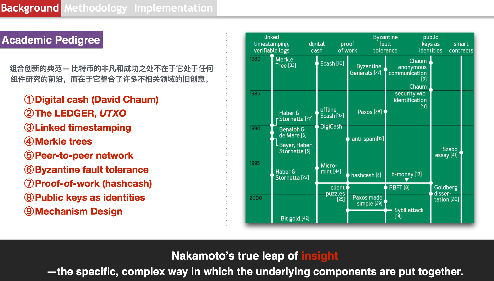

# Bitcoin Academic Pedigree

Nakamoto’s true leap of insight — the specific, complex way in which the underlying components are put together:

I will discuss these technologies and build a simple blockchain system using Python. The main points are summarized as follows:
- Digital cash and double-spending problem;
- The ledger and the global data structure;
- Linked timestamp and Merkle Tree;
- Blockchain structure, transaction and script;
- Byzantine fault tolerance & Hashcash and sybil-resistant networks;
- Proof-of-work, mining and digital currency incentive;
- Fork and consensus (the longest chain selection).
- [A Python-based blockchain system](./code).
