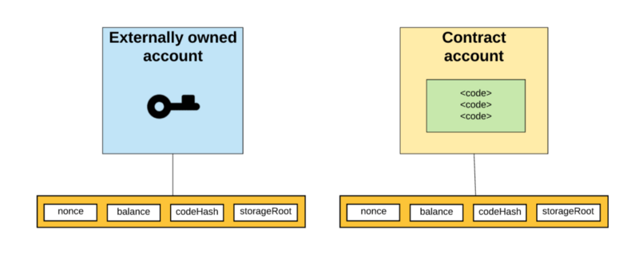
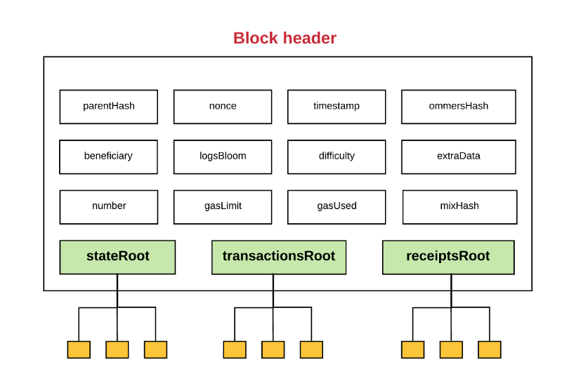
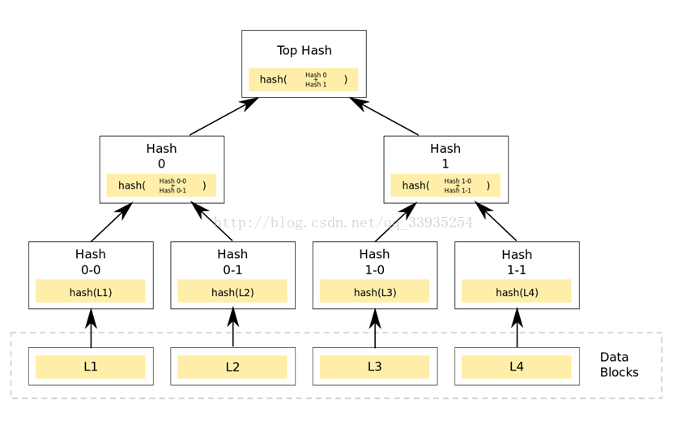
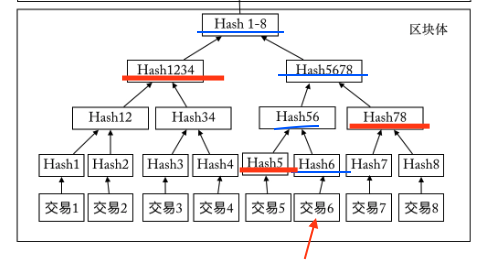
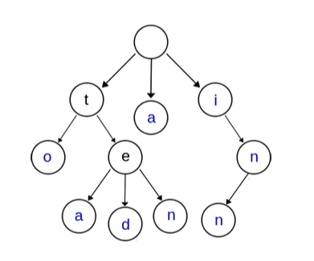
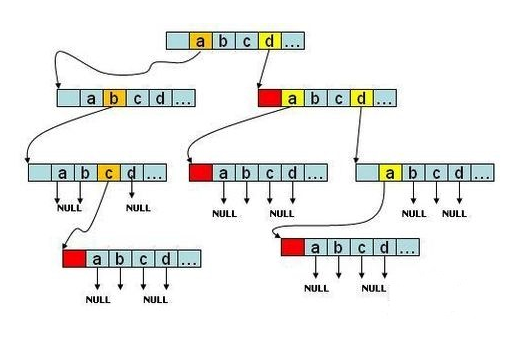
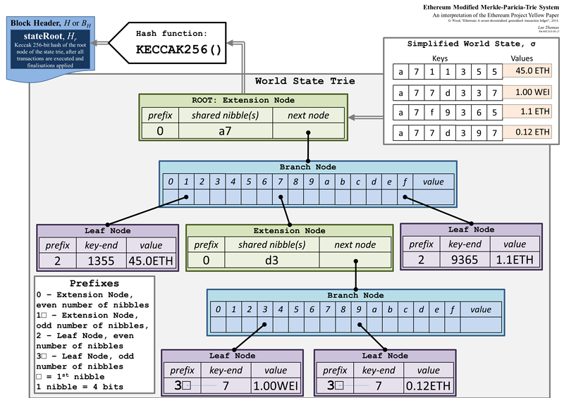
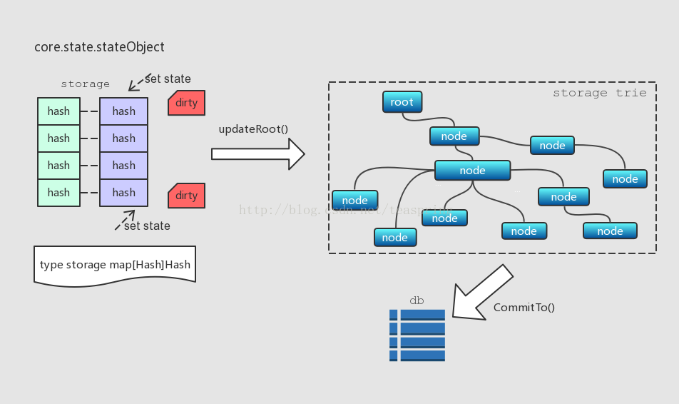

# 以太坊

## 1.账户

以太坊有两种账户类型：

* 外部账户：由用户私钥控制，没有代码与之关联
* 内部账户：合约账户，由合约代码控制

外部账户之间可以相互转账，进行价值转移；外部账户到合约账户的消息会触发合约代码的执行。

账户结构：

* nonce: 若是外部账户，nonce表示交易序号；若是合约账户，nonce表示合约序号
* balance：账户余额
* storageRoot：外部账户此项为空；对合约账户，为MPT树根节点Hash，MPT树中保存合约中的相关变量
* codeHash：外部账户此项为空字符串Hash；合约账户此项为合约代码Hash值

## 2.区块结构

以太坊区块头包含了以下这些字段：

以太坊区块链数据的存取涉及到四棵树：

* 状态树：保存以太坊网络中所有账户的状态，全局唯一
* 交易树：包含了一个区块中所有的交易信息，每个区块都有一个交易树
* 收据树：记录此区块中所有交易完成后生成的收据列表，每个区块都有一个收据树
* 存储树：保存智能合约中涉及到的数据，是状态树的一个子树，仅智能合约账户下跟有存储树

以太坊区块链数据持久化保存在levelDB中，区块中只保存Header中的内容，三个树存在于内存中，账户状态的改变首先会在树上更新，之后再将树的内容写入数据库。

## 3. MPT树

### (1) Merkle tree

​	将数据分块，每块分别计算Hash，得到数据块Hash后将Hash两两组合，计算组合字符串的Hash（落单的Hash值直接对其再进行一次Hash），这样一层层迭代，形成一个倒立的树形结构，即Merkle树：

​	从其形成过程可见，对数据块的任何改变都会传导到树根，导致根Hash值的改变，因此利用Merkle树可以方便快速地校验数据的完整性，利用Merkle树的这一特性还可以实现SPV，让轻节点成为可能。

​	轻节点：只保存区块头信息的节点

​	全节点：保存所有区块数据的节点

简单支付验证（SPV）：

​	考虑这样一个场景：A告诉B自己给B转了一笔钱，B如何来验证这笔交易的真实性？

​	假如A向B的转账是上图中交易6，则B验证此交易的流程如下：

* 计算待验证交易的Hash值
* B从区块链网络获取最长链的所有区块头并保存至本地
* B从区块链获取待验证交易的Hash认证路径（图中红色线标出的Hash）
* 根据认证路径，计算Merkle树根Hash值，将根Hash与之前获取的所有区块头中的Merkle根Hash进行比较，定位到包含此交易的区块
* 根据该区块所处位置，确定该交易已经得到了足够次数的确认（比特币6次，以太坊15~30次）

### (2) Trie

​	字典树（Trie）是一种查询效率很高的数据结构，有以下3个基本性质：

1. 根节点不含字符，其他节点每个节点都只包含一个字符
2. 从根节点到某节点路径上经过的字符串连接起来为该节点对应的字符串
3. 每个节点的所有子节点包含的字符都不相同

​	字典树应该是一个26叉树，因为每个节点可能的值有26种：

​	增加单词：从根节点开始，顺着路径查找，如果此单词不在树中，新增几个保存新单词不在树中部分字母的节点即可

​	删除单词：从根节点开始向下查找，找到要删除的单词后，删除掉此单词独有的节点即可

### (3) MPT

​	以太坊中的MPT树组合了Merkle树和字典树，并且对字典树做了改进

​	MPT中有四种节点类型：

* 空节点：用来表示空字符串
* 分支节点：用来表示拥有超过一个子节点的非叶节点
* 叶节点：键值对，叶节点value字段为从根节点到叶节点路径形成的key所索引的值信息，对应数据库中的一个键值对
* 扩展节点：键值对，value字段为指向另一个节点的指针，即数据库中子节点的索引，也就是子节点的Hash值

​	以太坊通过对key进行编码来区分叶节点和扩展节点：

1. raw编码：原生的字符，'cat'->['c', 'a', 't']

2. hex编码：将raw编码的每个字符按照高4位低4位拆成两个字节，若为叶节点，则在末位添加一个ASCII值为16的字符作为终止标志位，若为扩展节点则不加任何字符

3. HP编码：由hex编码转换而来；若hex编码形式末尾字节值为16则去掉该字节，然后在hex编码前加一个半字节，其最低位用来标识key长度的奇偶，低2位叶节点为1，扩展节点为0；若key长度为奇数，再在当前key前加一个值为0x0的半字节，然后将key进行压缩，原本拆开的两个字节压缩成一个字节

   三种编码的转换关系如下：

   

   * MPT对外提供的接口使用raw编码，向树中插入数据时raw编码转换为hex编码
   * hex编码用于对内存里树中的key进行编码，当树中数据被写入数据库时hex编码被转换为HP编码
   * HP编码用于对数据库中树节点key进行编码，当树节点被加载到内存时HP编码被转换为hex编码

## 4.世界状态更新流程

​	MPT树存在于内存中，状态更新时先更新MPT树的状态，最后再写入数据库，MPT树在这里就相当于一个缓存，实际上，以太坊里还有一级缓存：以太坊地址到stateObject的映射，stateObject中保存的就是对应地址账户中的四个字段：nonce、balance、storageRoot以及codeHash，这一级缓存保存的是活跃的账户。

​	下面描述一下个人理解的从发起一笔交易到世界状态被更新的整个流程：

* 账户A向B转账10ETH（假设均为外部账户），交易全网广播
* 矿工接收到这笔交易后，提取出发送方和接收方的地址
* 首先在stateObjects中查找发送方（接收方）的地址，如果找到，则将对应stateObject中的balance减10（加10），发送方nonce值加1，接收方不变；
* 如果没有在stateObjects中找到相关地址，则根据账户地址的hex编码去状态树中查找，如果找到，将此账户地址到账户数据的映射加入map中，然后更新stateObject中相应的字段值；
* 如果状态树中仍未找到，则用账户地址的HP编码作为key去数据库中查找，将找到的value和key插入到状态树中，并将地址-账户数据的映射插入到map中，然后更新stateObject中对应的字段值
* stateObject中的值被修改后会被标记为dirty，标为dirty的stateObjects会被更新到状态树中
* 当前区块中的所有交易对状态树的更新完成后，计算出状态树根Hash，即为此区块头中所包含的状态树根Hash值，并将更新后的状态树写入到数据库中

(个人总结理解，如有错误，欢迎指正)

Ref:

1. https://blog.csdn.net/teaspring/article/details/75390210
2. https://github.com/ZtesoftCS/go-ethereum-code-analysis
3. https://lilymoana.github.io/ethereum_theory.html
4. https://blog.csdn.net/zslomo/article/details/53434883
5. https://ethfans.org/toya/articles/588
6. https://segmentfault.com/a/1190000016050921
7. https://ethfans.org/posts/diving-into-ethereums-world-state-part-1
8. http://www.cnblogs.com/fengzhiwu/p/5584809.html

