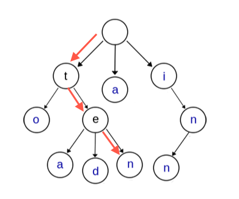
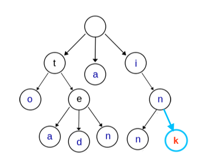
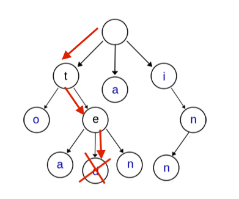
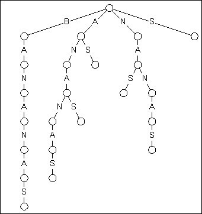
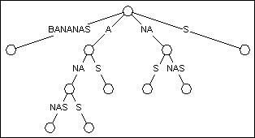
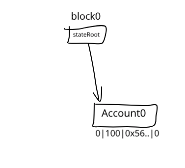
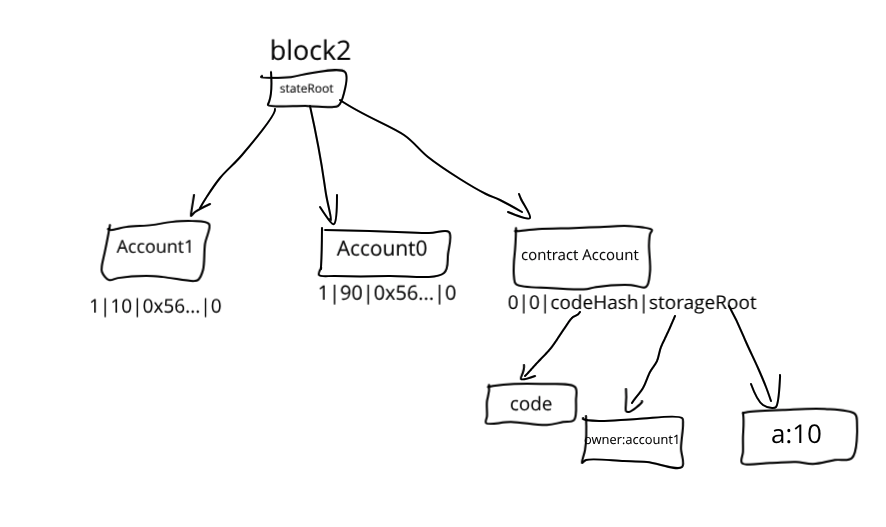
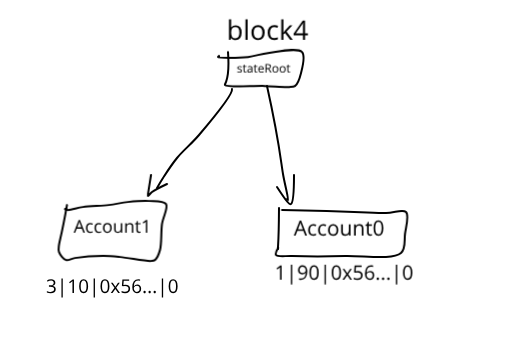

# 以太坊MPT树

### (1) Merkle tree

​	将数据分块，每块分别计算Hash，得到数据块Hash后将Hash两两组合，计算组合字符串的Hash（落单的Hash值直接对其再进行一次Hash），这样一层层迭代，形成一个倒立的树形结构，即Merkle树：


​	从其形成过程可见，对数据块的任何改变都会传导到树根，导致根Hash值的改变，因此利用Merkle树可以方便快速地校验数据的完整性，利用Merkle树的这一特性还可以实现SPV，让轻节点成为可能。

​	轻节点：只保存区块头信息的节点

​	全节点：保存所有区块数据的节点

简单支付验证（SPV）：

​	考虑这样一个场景：A告诉B自己给B转了一笔钱，B如何来验证这笔交易的真实性？


​	假如A向B的转账是上图中交易6，则B验证此交易的流程如下：

* 计算待验证交易的Hash值
* B从区块链网络获取最长链的所有区块头并保存至本地
* B从区块链获取待验证交易的Hash认证路径（图中红色线标出的Hash）
* 根据认证路径，计算Merkle树根Hash值，将根Hash与之前获取的所有区块头中的Merkle根Hash进行比较，定位到包含此交易的区块
* 根据该区块所处位置，确定该交易已经得到了足够次数的确认（比特币6次，以太坊15~30次）

### (2) Trie

​	字典树（Trie）是一种查询效率很高的数据结构，有以下3个基本性质：

1. 根节点不含字符，其他节点每个节点都只包含一个字符
2. 从根节点到某节点路径上经过的字符串连接起来为该节点对应的字符串
3. 每个节点的所有子节点包含的字符都不相同


​	查询：从根节点开始，一个个向下匹配字母即可，查找ten：



​	增加单词：从根节点开始，顺着路径查找，如果此单词不在树中，从共享路径后分叉出新的节点保存新单词剩下的字母，插入ink：



​	删除单词：从根节点开始向下查找，找到要删除的单词后，删除掉此单词独有的节点即可，删除ted：



​	实现的时候，每个节点都需要一个长度为26的数组，如果对应位置有分叉，则保存子节点的地址，如果没有则为NULL


缺点：每个节点保存一个字符，会导致树深度很深，浪费存储空间：



因此以太坊的MPT中对Trie进行了改进：路径压缩，上图中的树经过路径压缩后：



## (3) MPT

​	MPT树组合了Merkle树和Trie，并在此基础上做了一些改进：

1. 安全性

   ​	在Trie中，每个节点都是通过其内存地址值被引用，而在MPT中，节点通过Hash值被引用，这个Hash值是节点内容RLP编码后的Hash值；想要获取节点内容，只需用此Hash值作为key在数据库中找到对应的value，然后RLP解码即可

2. 路径压缩

   MPT中有四种节点类型：

   * 空节点：用来表示空字符串
   * 分支节点：用来表示拥有超过一个子节点的非叶节点，长度为17的list，最后一个元素是value，说明分支节点既可以是搜索路径的中间节点也可以是搜索路径的终止
   * 叶节点：[key-end, value]，value为数据的RLP编码形式
   * 扩展节点：[shared-nibbles, value]，value为子节点Hash值

   MPT中的路径压缩主要通过引入叶节点和扩展节点来实现，扩展节点中的第一个字段shared-nibbles保存共享的路径，叶节点的第一个字段key-end保存这个key独有的后缀，通过引入这两种节点，降低了树的深度，节省存储空间


## 4.世界状态的更新

​	下面通过几个简单的例子说明世界状态是如何更新的，为了简便，这里假设每一步被包含在一个新区块中，且所有key之间不存在共享路径，不考虑gas费

​	（1） 创世阶段，状态树中仅有一个账户：

​		每个账户包含如下几个字段：

​		

​		block0中的状态树（其中0x56…为空字符串hash值，假设余额为100Ether）：

​		​	

​	（2）创建一个账户并从Account0向新账户转账10Ether：

​		 Account0的Nonce加1， Balance减少10


​	（3）Account1创建一个简单的合约：

```js
pragma solidity ^0.4.0;

contract Demo {
    uint a;
	address owner;
	
	// constructor
	function Demo() {
		owner = msg.sender;
		a = 10;
	}

	// get 
    function setA(uint x) {
        a = x;
    }

	// set
    function getA() constant returns (uint) {
        return a;
    }

	// destructor
	function kill() {
		if(owner == msg.sender){
			selfdestruct(owner);
		}
	}
}
```

​	此时状态树如下：



​	注意到此时Account1的Nonce变为1

​	（4）调用合约set函数设置a的值为20：

​		Account1发起调用后，Nonce加1，在交易信息中找到合约账户，将合约地址hex编码后作为key在状态树中查找到对应节点，然后通过合约账户中的codeHash在数据库里找到合约代码，将被调用代码载入evm执行，a的值被设为20


​	（5）销毁合约：

​		如果合约不再使用，可以通过调用合约中的kill函数销毁合约。kill函数通过调用selfdestruct销毁合约，合约账户节点在状态树中被删除，合约地址仍可以接收转账，向销毁合约地址的转账不能找回。



Ref:

1. https://blog.csdn.net/teaspring/article/details/75390210
2. https://github.com/ZtesoftCS/go-ethereum-code-analysis
3. https://lilymoana.github.io/ethereum_theory.html
4. https://blog.csdn.net/zslomo/article/details/53434883
5. https://ethfans.org/toya/articles/588
6. https://segmentfault.com/a/1190000016050921
7. https://ethfans.org/posts/diving-into-ethereums-world-state-part-1
8. http://www.cnblogs.com/fengzhiwu/p/5584809.html
9. https://ethereum.stackexchange.com/questions/54660/how-selfdestruct-works
10. https://github.com/ethereum/EIPs/issues/911


