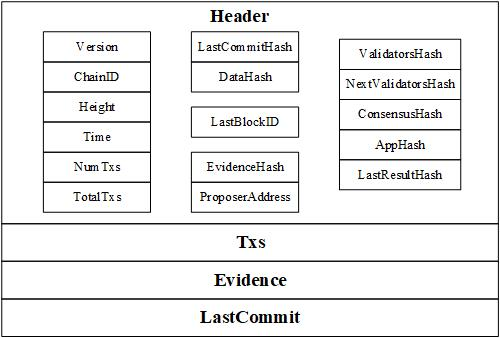

# Tendermint  

　　Tendermint是一个能够在不同机器上，安全一致复用的应用软件。Tendermint框架设计是将区块链应用与共识进行分离，其框架示意图如下图所示。Tendermint框架
可分为Tendermint Core和ABCI (Application BlockChain Interface)两部分，其中Tendermint Core是Tendermint的核心，实现共识与数据传输；ABCI是
Tendermint Core与区块链应用的接口。 Tendermint支持开发者们使用不同语言开发各自的区块链应用，无需考虑共识和网络传输的实现。  
<div align= center>  
    
</div>　　
　　

　　在本文中，会先介绍由tendermint搭建的区块链中的数据结构，再介绍tendermint框架中的tendermint core，其中包括tendermint的BPOS的共识过程、锁定机制以及PoLC等，最后将介绍tendermint core如何利用ABCI与应用进行交互。
 ## 数据结构  
 ### Block  
 
 　　在tendermint中，Block结构如下图所示。  
<div align= center>  
    
</div>  

   在`Header`中，记录当前区块基本信息的有:  
   　`Version`: 包括app version和tendermint version  
   　`ChainID`: 区块链名称  
   　`Height`:该区块所属高度  
   　`Time`:出块时间  
   　`NumTxs`：当前区块打包的交易数  
   　`TotalTxs`:该区块之前所有区块（包括当前区块）打包的交易数  
   同时也记录了前一区块的信息：  
   　`LastBlockID`:前一区块的BlockID,包括了前一区块的header的merkle根hash值以及包括了上一区块序列化分块的merkle根hash值  
   还有关于前一区块的确认和执行结果：  
  　 `LastCommitHash`:validator set关于上一区块的投票`LastCommot`的merkle根hash值（Simple Merkle root）  
  　 `LastResultHash`:上一区块交易执行后结果的merkle根hash值  
   关于共识的相关信息：  
   　`ValidatorsHash`:当前区块的验证者集merkle根hash值  
   　`NextValidatorsHash`:下一区块的验证者集merkle根hash值  
   　`ConsensusHash`:当前区块amino编码的共识参数的hash值  
   关于当前区块内容的有：  
   　`EvidenceHash`:记录当前区块中验证者恶意行为的Evidence的merkle根hash值  
   　`DataHash`：当前区块打包交易的merkle根hash值  
   　`ProposerAddress`:当前区块打包者(proposer)的地址  
   此外，还有表示应用状态：  
   　`AppHash`：应用确认和执行上一区块返回的任意字节数组，表示应用状态，用于验证应用提供的merkle proofs。  
   以上是对Block区块包含数据的简要介绍，具体详见[tendermint:block](https://github.com/tendermint/tendermint/blob/master/docs/spec/blockchain/blockchain.md)  
   ### State  
   在Tendermint区块链中，交易执行结果、验证者、共识参数等并没有直接存储在区块block中，而是将其存储在了数据结构State，而State则存储在应用中。当tendermint core需要相应的参数时，通过ABCI接口向应用（application）获取这些信息。State的结构如下图所示:  
<div align= center>  
    
</div>  
  
   其具体参数解释可见[tendermint:state](https://github.com/tendermint/tendermint/blob/master/docs/spec/blockchain/state.md)  
   ### Block与State中数据联系  
   　　下图表示了Block和State中各数据之间的联系。Note:BlockID并不只有`Header`的Merkle Root。  
       
       
   
   
 ## Tendermint Core  
 Tendermint Core主要实现共识和网络数据传输，其中共识采用拜占庭POS协议。接下来将详细介绍tendermint的共识过程。  
 ### 共识BPOS  
 　　与通过计算随机数来获取记账权的POW（Proof-of-Work）不同，POS（Proof-of-Stake）是计算持有占总币数的百分比以及占有币数的时间来决定记账权，节点持有的权益越多，获取记账权的难度越低。在Tendermint的BPOS（Bonded Proof-of-Stake）中，节点也是通过持有权益来获取记账权：节点通过抵押权益代币（Atom）成为验证者，其投票权与抵押代币的多少相关，抵押的代币占总抵押代币的比例越大，投票权越多，验证者可根据抵押权益代币的多少轮流出块。其共识过程主要有两个阶段：**预投票（prevote）**和**预确认（precommit）**，只有当某一区块得到>2/3权益的预确认投票，该区块才能被提交到链上。BPOS也属于拜占庭容错算法。其简要共识过程如下：  
 1) 通过各验证者的权益计算出块优先权，确定当前高度的出块者；  
 2) 选定的出块者提交区块；  
 3) 预投票: 各节点接收到区块之后，验证区块提交预投票(prevote);  
 4) 预确认：在接受到>2/3的prevote或超时之后，节点对同一区块提交预确认(precommit);  
 5) 当接收到对提交区块的>2/3的precommit之后，该区块被提交到链上，否则共识失败，进入下一轮共识过程。  
 从以上BPOS的简要共识过程可看出，BPOS的特点有：**强一致性**、**不允许分叉**、投票权与抵押代币相关。以下将详细介绍BPOS的共识机制。  
 #### 验证者Validator  
 * 用户可以通过抵押Atom、签署并提交BondTx交易成为验证者Validator。  
 * 验证者具有投票权，投票权大小与抵押的Atom多少相关。  
 * 验证者在共识过程中轮流出块。  
 * 验证者有数量限制，初始为100位，此后每年增长13%，最终达到300位。  
 * Cosmos Hub验证者可接受任何种类的代币或组合作为处理交易的费用，自行设置兑换率。  
 * 对于任何有意或无意的偏离认可协议的验证者, 对其施加一定的惩罚。  
 * 验证者的更改将在更改交易所属区块之后的第二个区块生效。

 #### 成为出块者Proposer  
 　　验证者根据投票权的比例轮流成为出块者，投票权votingPower越大，其成为出块者的频率越高。验证者出块优先权的计算方式为： 
 ```  
 在R轮：  
 1. 验证者出块优先权=（R-1）轮出块优先权+投票权  
 2. 选择出块优先权最大的验证者为出块者，优先权相同时，按地址排序  
 3. 出块者出块优先权=出块优先权-总的投票权  
 4. 进入下一轮  
 ```  
 以(p1,4),(p2,5),(p3,8),(p4,3)为例，其出块顺序为p3,p2,p1,p3,p4,p2...具体可见[proposer-selection-procedure-in-tendermint](https://github.com/tendermint/tendermint/blob/master/docs/spec/reactors/consensus/proposer-selection.md#proposer-selection-procedure-in-tendermint), [Tendermint共识之Validator](https://blog.csdn.net/csds319/article/details/81137878)和[validator_set](https://github.com/tendermint/tendermint/blob/develop/types/validator_set.go)  
 
 #### 共识过程  
 　　BPOS共识过程流程图可由下图表示：  
     
   其详细步骤可见[Tendermint:byzantine-consensus-algorithm](https://github.com/tendermint/tendermint/blob/master/docs/spec/consensus/consensus.md#byzantine-consensus-algorithm)  
   以下将介绍保证BPOS的强一致性的两个概念：**锁定机制（Proof of Lock）**和**锁变化证明(Proof of Lock Change)**。   
 ##### 锁定机制PoL  
 
 　　一旦验证者预确认(precommit)了某一个区块，该验证者锁定在这区块上，然后：  
 * 该验证者必须对锁定的区块进行预投票（在之后轮数）  
 * 如果之后轮数中有polka证明（超过三分之二的验证者预先投票给同一个区块，也可认为是Proof of Lock Change，PoLC），该验证者只能解锁并验证新区块  
 ##### 锁变化证明PoLC  
　　 一个包含超过2/3的对应于处在某一高度某一轮次提交的特定区块或者<nil>（空区块）的prevote的集合，称为锁变化证明(Proof of Lock Change, PoLC)。PoLC相当于解开锁定机制PoL的一把钥匙，将验证者与被锁定的区块解锁，避免由于验证者被锁在不同区块上导致共识无法继续的情况。锁定机制与锁变化证明在共识过程中的作用可由下图说明，假设：  
 * 验证者1~9和X的抵押代币一致，即各验证者的投票权一致；  
 * 验证者8、9和X是恶意节点
   
 上图中，验证者1和2在第R轮与区块A进行所锁定，所以在第R+1轮时验证者将预投票投给了区块A。同时在第R+1轮有PoLC。到了第R+2轮，验证者1和2与区块A解锁，将预投票投给了区块B。如果没有PoLC使验证者1和2对区块A进行解锁，区块B的提交将取决于恶意节点，使得共识无法进行。  


 
 ### 网络  
 Tendermint 支持以下RPC protocols:  
 
* URI over HTTP
* JSONRPC over HTTP
* JSONRPC over websockets  
　　具体请见  

　　Tendermint P2P协议使用基于站对站协议（Station-to-Station Protocol）的认证加密方案，具体请见[Tendermint:p2p](https://github.com/tendermint/tendermint/tree/master/docs/spec/p2p).
 
 ## ABCI  
 　　ABCI（Application BlockChain Interface）是Tendermint与应用之间的接口，包含一系列函数，每个函数都有相应的请求和响应消息类型。Tendermint通过发送`Request`消息调用应用中的ABCI函数（methods）并获得相应的`Reponse`消息。所有消息类型都在protobuf文件中定义，这使开发者可以使用任何编程语言编写应用程序。官方给出的ABCI的示意图如下：  
<div align= center>  
    
</div>  
  
　　在ABCI中，ABCI连接根据ABCI函数被分为三个独立的ABCI连接（ABCI connection）： 
* `Consensus Connection`:由共识协议驱动，并负责区块执行  
　　　* `InitChain`:在区块链创建时调用，向应用传送相应的初始验证者集及相应的共识参数  
　　　* `BeginBlock`:区块交易开始传输前调用，向应用传输区块hash值及区块头（Header）  
　　　* `DeliverTx`:向区块传输交易，返回交易执行结果相关参数  
　　　* `EndBlock`:表示区块传输结束，在所有交易传输之后、区块提交（commit）之前调用，返回验证者集更新、共识参数更新相关参数  
　　　* `Commit`:确认区块，返回应用保存的State的merkle root hash，可存于下一区块头  
* `Mempool Connection`: 在交易进入mempool之前（传输或打包进区块之前）验证交易  
　　　* `CheckTx`:验证交易签名或账户余额等，并不执行交易  
* `Info Connection`: 初始化和用户查询  
　　　* `Info`: 返回应用State的相关信息，启动时tendermint与应用之间同步  
　　　* `SetOption`: 设置非共识关键应用的特定选项  
　　　* `Query`: 向应用查询当前和以前高度的相关数据，可返回merkle proof  
　　开发者在开发应用时，必须实现相应编程语言的ABCI Server。在用go语言时，Tendermint支持ABCI的三种实现：In-process (Golang only)、ABCI-socket和GRPC。此外还有JavaScript, Python, C++和Java。详情请见[Tendermint: ABCI](https://tendermint.com/docs/spec/abci/)  
在不同语言使用ABCI，需实现：  
* 一个Socket Server  
* 能够处理ABCI Message  
* 实现区块链应用接口（ABCI）

## Refs  
[1]. https://github.com/tendermint/tendermint/tree/develop/docs  
[2]. https://cosmos.network/docs/resources/whitepaper-zh-CN.html#tendermint  
[3]. https://mp.weixin.qq.com/s?__biz=MzUyMjg0MzIxMA==&mid=2247483679&idx=1&sn=1fadfa95a266e199c3f2966c2decfbae&chksm=f9c4e43aceb36d2c19f07450f98a2938ef345aeb454f0f668057e66a89adb0dfda91910cccd9&scene=21#wechat_redirect

 
